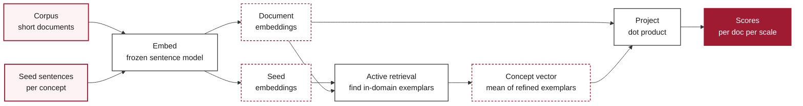

<div align="center">
  
  <h1>SPAR: Semantic Projection with Active Retrieval</h1>
  <p><em>Measure short text against theoretical concepts. No labels, no fine-tuning.</em></p>
</div>

<div align="center">

[](https://colab.research.google.com/github/maifeng/SPAR_measure/blob/master/resources/example_colab.ipynb)
[](https://colab.research.google.com/github/maifeng/SPAR_measure/blob/master/resources/example_colab_headless.ipynb)
[](https://pypi.org/project/spar-measure/)
[](LICENSE)

</div>

---

- [Overview](#overview)
- [Two ways to try it (one click each)](#two-ways-to-try-it-one-click-each)
- [Install](#install)
- [Interactive GUI walkthrough](#interactive-gui-walkthrough)
- [Headless API: 90-second tour](#headless-api-90-second-tour)
- [The `score()` knobs](#the-score-knobs)
- [Headless CLI](#headless-cli)
- [Limitations](#limitations)
- [Citation](#citation)
- [License](#license)

## Overview

SPAR is a Python NLP package that quantifies short documents (social media posts, earnings-call sentences, employee reviews) against theoretical concepts such as *innovation*, *collaboration*, or *risk* — **without training a model and without hand-labeling a single document**. You provide a corpus and a few generic seed sentences per concept; SPAR uses a frozen pretrained sentence encoder and **active retrieval** to refine those seeds into a domain-grounded concept vector, then projects each document onto the vector to produce a continuous score.


```mermaid
flowchart LR
    A[Corpus<br/>short documents] --> EMB[Embed<br/>frozen sentence model]
    B[Seed sentences<br/>per concept] --> EMB
    EMB --> DE[Document<br/>embeddings]
    EMB --> SE[Seed<br/>embeddings]
    SE --> AR[Active retrieval<br/>find in-domain exemplars]
    DE --> AR
    AR --> CV[Concept vector<br/>mean of refined exemplars]
    DE --> P[Project<br/>dot product]
    CV --> P
    P --> O[Scores<br/>per doc per scale]

    classDef input fill:#fef3f4,stroke:#9E1B32,stroke-width:2px,color:#1a1a1a
    classDef process fill:#ffffff,stroke:#444,stroke-width:1.5px,color:#1a1a1a
    classDef vector fill:#ffffff,stroke:#9E1B32,stroke-width:1.5px,stroke-dasharray:4 3,color:#1a1a1a
    classDef output fill:#9E1B32,stroke:#9E1B32,stroke-width:2px,color:#ffffff

    class A,B input
    class EMB,AR,P process
    class DE,SE,CV vector
    class O output
```

The result is a continuous score per concept per document, grounded in your domain, produced without labels and without any gradient updates.

**Main features:**

- Domain-adaptive few-shot measurement of theoretical concepts; no training or fine-tuning.
- Active semantic search lets users discover the most relevant context-specific seed sentences in their own corpus.
- Multiple state-of-the-art text embedding backends: [Sentence-Transformers](https://www.sbert.net/docs/pretrained_models.html), [OpenAI Text Embeddings](https://platform.openai.com/docs/guides/embeddings).
- Two paths: a friendly **Gradio web UI** for exploration and seed iteration, and a **headless `score()` API** for batch jobs and reproducible pipelines.
- Optional **ChromaDB** persistence for very large corpora.
- Optional **ZCA whitening** to decorrelate scales when they share dimensions.

**Reference:**

> Yan, Bei, Feng Mai, Chaojiang Wu, Rong Chen, and Xiaolin Li (2024).
> "A Computational Framework for Understanding Firm Communication During Disasters."
> *Information Systems Research* 35(2):590-608.
> [doi.org/10.1287/isre.2022.0128](https://doi.org/10.1287/isre.2022.0128)

Built on top of [Hugging Face Transformers](https://huggingface.co/transformers/), [Sentence-Transformers](https://github.com/UKPLab/sentence-transformers/), and [Gradio](https://gradio.app/).

## Two ways to try it (one click each)

| Notebook | What you do | Click to launch |
|---|---|---|
| **GUI Quickstart** | Launch the Gradio web app inside Colab. Upload a CSV, embed, iterate seeds via active retrieval, define scales, and download scored CSV. | [](https://colab.research.google.com/github/maifeng/SPAR_measure/blob/master/resources/example_colab.ipynb) |
| **Headless API Quickstart** | Score 2,000 documents in 60 seconds using the `score()` function. No GUI, no API key, runs on the bundled sample corpus. | [](https://colab.research.google.com/github/maifeng/SPAR_measure/blob/master/resources/example_colab_headless.ipynb) |

## Install

```bash
pip install -U spar-measure
```

Optional extras:

```bash
pip install "spar-measure[vector]"   # ChromaDB persistence for big corpora
pip install "spar-measure[dev]"      # pytest + gradio_client for contributing
```

Python 3.10 or later. GPU is used automatically when available. To force CPU:

```bash
CUDA_VISIBLE_DEVICES="" python -m spar_measure gui
```

To launch the GUI on your own machine:

```bash
python -m spar_measure gui
```

then open the interactive app in your browser at `http://localhost:7860/`.

See the full [user manual](resources/Manual.MD) for advanced usage.

## Interactive GUI walkthrough

The GUI is the best place to discover good seed queries for a new construct. It walks you through the entire pipeline in a browser. Below is the five-step flow.

**1. Upload a CSV with text and ID columns. Choose an embedding model. Embed.**


**2. Define dimensions with generic seed sentences.** For example:

- `Creative`: *"We should adapt and innovate."*
- `Positive emotion`: *"We are happy."*
- `Danger`: *"It is dangerous."*


**3. Active retrieval.** Use the generic seeds as queries, search the corpus for similar sentences, and refine. For example:

- `Creative`:
  - *"Digital technology will play a huge role going forward."*
  - *"How do you adapt to these uncharted waters?"*
- `Positive emotion`:
  - *"The smiling faces say it all."*
  - *"A round of applause to all of our recent WaFd Foundation grant recipients!"*
- `Danger`: *"How do you prevent the spread of a deadly virus?"*

Repeat: feed the relevant outputs back as new queries to surface more exemplars. When the retrieved set looks in-domain, click **"Embed Queries and Save Dimensions"**. The averaged embedding of the refined exemplars defines the scale.


**4. Define scales.** A scale is one or more positive dimensions minus one or more negative dimensions. For example:

- `Sentiment = Positive emotion − Negative emotion`
- `Creativity = Creative`


**5. Score the corpus.** Project each document embedding onto each scale. Download the resulting CSV.


## Headless API: 90-second tour

For batch jobs, reproducible pipelines, and Colab demos, skip the GUI and call `score()` directly. Below: three short documents scored on a single bipolar scale, **Innovation − Tradition**.

```python
import pandas as pd
from spar_measure import score

docs = pd.DataFrame({
    "doc_id": [0, 1, 2],
    "text": [
        "We encourage new ways of thinking.",
        "Quarterly results exceeded analyst expectations.",
        "We honor the founders' commitment to quality.",
    ],
})

scales = {
    "dimensions": {
        "Innovation": {"queries": [
            "We constantly experiment with new ideas.",
            "We embrace change and disruption.",
            "Innovation drives everything we do.",
        ]},
        "Tradition": {"queries": [
            "We honor the practices that built this company.",
            "We trust time-tested ways of working.",
            "Our heritage and craft define who we are.",
        ]},
    },
    "scales": {
        "Innovation-Tradition": {
            "pos_dims": ["Innovation"],
            "neg_dims": ["Tradition"],
        },
    },
}

out = score(docs, scales, text_col="text", id_col="doc_id")
print(out)
```

Output (reproducible with the default `all-MiniLM-L6-v2` backend):

| doc_id | text                                              | Innovation-Tradition |
|-------:|---------------------------------------------------|---------------------:|
|      0 | We encourage new ways of thinking.                |             **+0.27** |
|      1 | Quarterly results exceeded analyst expectations.  |             **+0.05** |
|      2 | We honor the founders' commitment to quality.     |             **−0.17** |

**Reading the scores:** positive means the document leans toward the positive pole (Innovation), negative leans toward the negative pole (Tradition), and magnitude is the strength of the lean. Doc 0 talks about new thinking and lands clearly on the Innovation side; doc 2 invokes founders and quality heritage and lands on the Tradition side; doc 1 is neutral business language and sits near zero.

Two data structures drive everything:

- `dimensions` maps a dimension name to a list of `queries` (the refined seed sentences).
- `scales` combines dimensions into a signed construct. The pattern `pos_dims − neg_dims` is the textbook bipolar scale; you can also build unipolar (`neg_dims=[]`) or multi-pole composite scales.

Switch to OpenAI embeddings with one extra keyword:

```python
out = score(
    docs, scales,
    text_col="text", id_col="doc_id",
    openai_api_key="sk-...",
    openai_embedding_model="text-embedding-3-large",
)
```

Reuse a precomputed embedding matrix:

```python
import numpy as np
embeddings = np.load("corpus_embeddings.npy")   # shape: (n_docs, dim)
out = score(docs, scales, text_col="text", id_col="doc_id",
            precomputed_embeddings=embeddings)
```

The full runnable demo (with the bundled 2,000-document sample corpus) lives in [`resources/example_colab_headless.ipynb`](resources/example_colab_headless.ipynb) — one click to open in Colab via the badge above.

## The `score()` knobs

```python
score(
    docs,                               # pandas DataFrame
    scales,                             # dict: dimensions + scales
    text_col="text",                    # column holding the text
    id_col="doc_id",                    # column holding the ID (auto-added if None)
    embedding_model=None,               # e.g. "all-MiniLM-L6-v2" or "text-embedding-3-large"
    openai_api_key=None,                # supply to switch to OpenAI embeddings
    openai_embedding_model="text-embedding-3-small",
    whiten=False,                       # apply ZCA whitening to the score matrix
    single_subspace=False,              # joint-subspace projection (S Sᵀ)⁺ S X
    batch_size=8,                       # embedding batch size
    precomputed_embeddings=None,        # (n_docs, dim) np.ndarray to skip embedding
)
```

Returns a DataFrame of shape `(n_docs, 1 + n_scales)` with the ID column first and one column per scale. Full signature and Google-style docstring live in `src/spar_measure/api.py`.

## Headless CLI

For one-off scoring from the shell:

```bash
python -m spar_measure measure \
    --docs=corpus.csv \
    --scales=scales.json \
    --out=scored.csv \
    --id_col=doc_id
```

`scales.json` has the same shape as the `scales` dict above.

## Limitations

- SPAR represents each document with a single vector, so it is not well suited to long or multi-topic documents. Pre-split into sentences or paragraphs and score those.
- Sentence embeddings encode meaning, not syntax. Constructs that hinge on syntactic features (negation polarity, modal voice, tense) are harder.
- Pretrained models carry a fixed world-knowledge cutoff. New vocabulary and new entities will be weakly represented.
- Semantic projection is a linear operation. Highly nonlinear constructs may benefit from supervised fine-tuning when labels are available.

## Citation

If you use SPAR in your research, please cite:

```bibtex
@article{yan2024spar,
  author  = {Yan, Bei and Mai, Feng and Wu, Chaojiang and Chen, Rong and Li, Xiaolin},
  title   = {A Computational Framework for Understanding Firm Communication During Disasters},
  journal = {Information Systems Research},
  volume  = {35},
  number  = {2},
  pages   = {590--608},
  year    = {2024},
  doi     = {10.1287/isre.2022.0128}
}
```

## License

[GPL-3.0](LICENSE).
