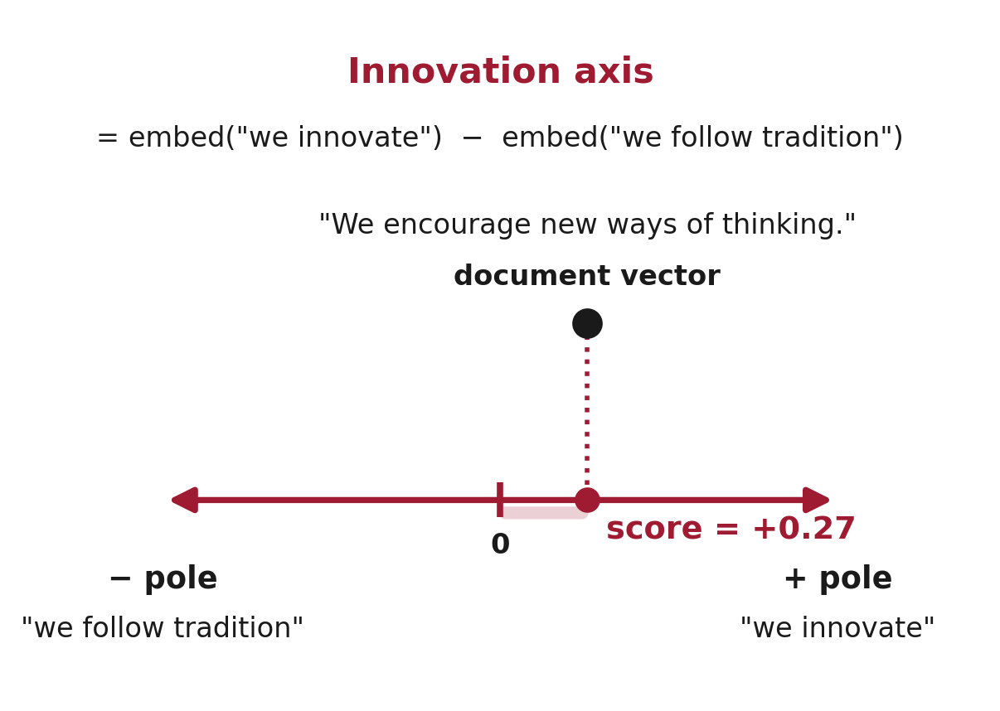
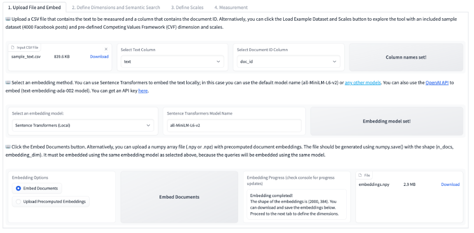
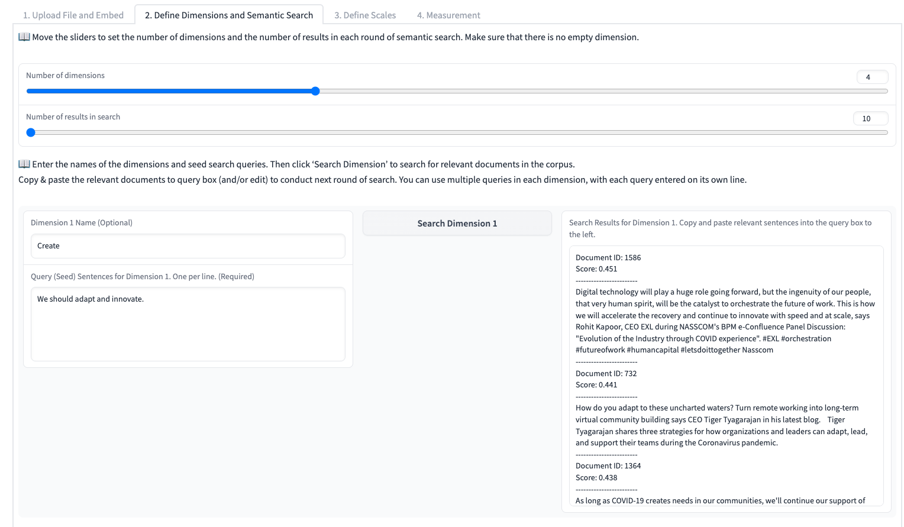
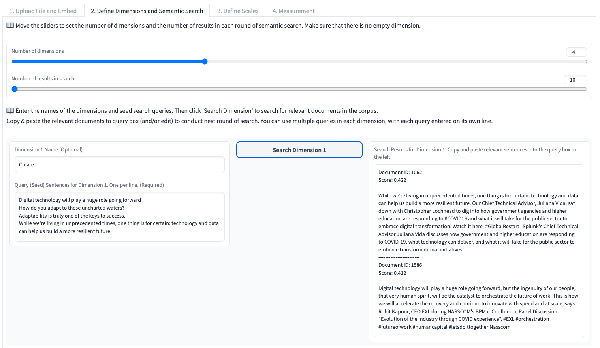
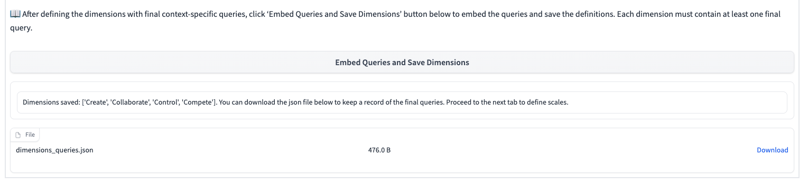
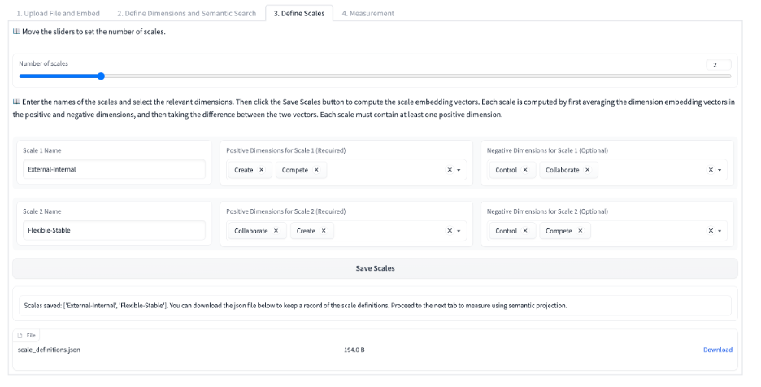
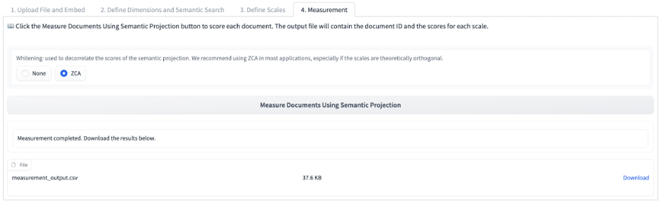

<div align="center">
  
  <h1>SPAR: Semantic Projection with Active Retrieval</h1>
  <p><em>Score short text on bipolar concepts you define as <code>positive_seeds − negative_seeds</code>.</em></p>
</div>

<div align="center">

[](https://colab.research.google.com/github/maifeng/SPAR_measure/blob/master/resources/example_colab.ipynb)
[](https://colab.research.google.com/github/maifeng/SPAR_measure/blob/master/resources/example_colab_headless.ipynb)
[](https://pypi.org/project/spar-measure/)
[](LICENSE)

</div>

---

- [Overview](#overview)
- [Quickstart notebooks](#quickstart-notebooks)
- [Install](#install)
- [GUI walkthrough](#gui-walkthrough)
- [Python API](#python-api)
- [ChromaStore: persistent embeddings for large corpora](#chromastore-persistent-embeddings-for-large-corpora)
- [`score()` reference](#score-reference)
- [Limitations](#limitations)
- [Citation](#citation)
- [License](#license)

## Overview

SPAR measures concepts in text by **semantic projection**. A concept is defined as a *difference between vector poles*:

- **Innovation** = embed("we innovate, we adapt") − embed("we trust tradition, we preserve")
- **Sentiment** = embed("we are happy, things are great") − embed("we are worried, things are bad")
- **Risk** = embed("uncertainty, exposure") − embed("safety, hedging")

Embed your seed sentences and your documents with the same pretrained sentence encoder. The concept axis is the (normalized) difference between the positive-pole and negative-pole seed averages. Each document's score on that concept is its dot product with the axis: positive scores lean toward the positive pole, negative scores toward the negative pole, and the magnitude is the strength of the lean.

<p align="center">
  
  <br/>
  <em>The Innovation axis is the difference between the two pole embeddings. A document vector is projected onto the axis (dotted line); the position of the projection is the score. <code>+0.27</code> is the actual <code>score()</code> output for this text under the seed sentences in the Python example below.</em>
</p>

**Active retrieval** addresses the second half of the problem: generic seed sentences like "we innovate" rarely point in the direction your corpus actually expresses the concept. SPAR retrieves the nearest neighbours of each seed from your corpus, lets you keep the in-domain ones (e.g., *"Cutting-edge AI now powers every team"*, *"Industrial automation investment is increasing"*), and re-anchors the concept vector on those refined exemplars. The GUI supports this iterative refinement loop; the headless `score()` API runs the final projection in one call once seeds are stable.

**Reference:**

> Yan, Bei, Feng Mai, Chaojiang Wu, Rui Chen, and Xiaolin Li (2024).
> "A Computational Framework for Understanding Firm Communication During Disasters."
> *Information Systems Research* 35(2):590-608.
> [doi.org/10.1287/isre.2022.0128](https://doi.org/10.1287/isre.2022.0128)

Backends: [Sentence-Transformers](https://www.sbert.net/) (default, runs locally on CPU/GPU) or [OpenAI Embeddings](https://platform.openai.com/docs/guides/embeddings). Optional [ChromaDB](https://www.trychroma.com/) persistence for large corpora. Optional ZCA whitening to decorrelate scales that share dimensions.

## Quickstart notebooks

| Notebook | Contents | Open |
|---|---|---|
| **GUI** | Launches the Gradio web app inside Colab. Upload a CSV, embed, iterate seeds via active retrieval, define scales, download scored CSV. | [](https://colab.research.google.com/github/maifeng/SPAR_measure/blob/master/resources/example_colab.ipynb) |
| **Headless API** | Scores 2,000 bundled-sample documents on a bipolar scale via `score()`. Runs on Colab CPU in about 60 seconds, no API key required. | [](https://colab.research.google.com/github/maifeng/SPAR_measure/blob/master/resources/example_colab_headless.ipynb) |

## Install

```bash
pip install -U spar-measure
```

Optional extras:

```bash
pip install "spar-measure[vector]"   # ChromaDB persistence for big corpora
pip install "spar-measure[dev]"      # pytest + gradio_client for contributing
```

Python 3.10 or later. GPU is used automatically when available. To force CPU:

```bash
CUDA_VISIBLE_DEVICES="" python -m spar_measure gui
```

To launch the GUI on your own machine:

```bash
python -m spar_measure gui
```

then open the interactive app in your browser at `http://localhost:7860/`.

## GUI walkthrough

The GUI walks through the pipeline in a browser, five steps:

**1. Upload a CSV with text and ID columns. Choose an embedding model. Embed.**



**2. Define dimensions with generic seed sentences.** For example:

- `Creative`: *"We should adapt and innovate."*
- `Positive emotion`: *"We are happy."*
- `Danger`: *"It is dangerous."*



**3. Active retrieval.** Use the generic seeds as queries, search the corpus for similar sentences, and refine. For example:

- `Creative`:
  - *"Digital technology will play a huge role going forward."*
  - *"How do you adapt to these uncharted waters?"*
- `Positive emotion`:
  - *"The smiling faces say it all."*
  - *"A round of applause to all of our recent WaFd Foundation grant recipients!"*
- `Danger`: *"How do you prevent the spread of a deadly virus?"*

Repeat: feed the relevant outputs back as new queries to surface more exemplars. When the retrieved set looks in-domain, click **"Embed Queries and Save Dimensions"**. The averaged embedding of the refined exemplars defines the scale.




**4. Define scales.** A scale is one or more positive dimensions minus one or more negative dimensions. For example:

- `Sentiment = Positive emotion − Negative emotion`
- `Creativity = Creative`



**5. Score the corpus.** Project each document embedding onto each scale. Download the resulting CSV.



**Hand-off to the Python API.** When you click *Save Scales*, the GUI also writes a single `scales.json` file in the format `score()` expects. Drop that file into a notebook and rerun the same scales headlessly on a much larger corpus:

```python
import json, pandas as pd
from spar_measure import score

spec = json.load(open("scales.json"))
out  = score(pd.read_csv("big_corpus.csv"), spec, text_col="text", id_col="doc_id")
```

No reshaping required: the GUI's exported file matches the API schema exactly.

## Python API

Once seeds are stable, call `score()` directly. Three short documents scored on **Innovation − Tradition**:

```python
import pandas as pd
from spar_measure import score

docs = pd.DataFrame({
    "doc_id": [0, 1, 2],
    "text": [
        "We encourage new ways of thinking.",
        "Quarterly results exceeded analyst expectations.",
        "We honor the founders' commitment to quality.",
    ],
})

scales = {
    "dimensions": {
        "Innovation": {"queries": [
            "We constantly experiment with new ideas.",
            "We embrace change and disruption.",
            "Innovation drives everything we do.",
        ]},
        "Tradition": {"queries": [
            "We honor the practices that built this company.",
            "We trust time-tested ways of working.",
            "Our heritage and craft define who we are.",
        ]},
    },
    "scales": {
        "Innovation-Tradition": {
            "pos_dims": ["Innovation"],
            "neg_dims": ["Tradition"],
        },
    },
}

out = score(docs, scales, text_col="text", id_col="doc_id")
print(out)
```

Output (reproducible with the default `all-MiniLM-L6-v2` backend):

| doc_id | text                                              | Innovation-Tradition |
|-------:|---------------------------------------------------|---------------------:|
|      0 | We encourage new ways of thinking.                |             **+0.27** |
|      1 | Quarterly results exceeded analyst expectations.  |             **+0.05** |
|      2 | We honor the founders' commitment to quality.     |             **−0.17** |

**Reading the scores:** positive means the document leans toward the positive pole (Innovation), negative leans toward the negative pole (Tradition), and magnitude is the strength of the lean. Doc 0 talks about new thinking and lands clearly on the Innovation side; doc 2 invokes founders and quality heritage and lands on the Tradition side; doc 1 is neutral business language and sits near zero.

Two data structures drive everything:

- `dimensions` maps a dimension name to a list of `queries` (the refined seed sentences).
- `scales` combines dimensions into a signed construct. `pos_dims − neg_dims` is the standard bipolar form; `neg_dims=[]` gives a unipolar scale; multi-pole composites are also supported.

Switch to OpenAI embeddings with one extra keyword:

```python
out = score(
    docs, scales,
    text_col="text", id_col="doc_id",
    openai_api_key="sk-...",
    openai_embedding_model="text-embedding-3-small",
)
```

Reuse a precomputed embedding matrix:

```python
import numpy as np
embeddings = np.load("corpus_embeddings.npy")   # shape: (n_docs, dim)
out = score(docs, scales, text_col="text", id_col="doc_id",
            precomputed_embeddings=embeddings)
```

The full runnable end-to-end demo on the bundled 2,000-document sample corpus lives in [`resources/example_colab_headless.ipynb`](resources/example_colab_headless.ipynb).

## ChromaStore: persistent embeddings for large corpora

For corpora of 50k+ documents, re-embedding on every run is slow. `ChromaStore` (available with `pip install "spar-measure[vector]"`) persists embeddings to disk via ChromaDB so subsequent runs skip the model entirely.

Three-step workflow:

```python
from spar_measure.vector_store import ChromaStore
from spar_measure import score

# Step 1: embed once and persist.
store = ChromaStore("my_corpus", persist_dir="/data/chroma")
store.embed_and_store(docs_df, text_col="text", model_name="all-MiniLM-L6-v2")

# Step 2: load on subsequent runs.
store = ChromaStore.load("/data/chroma", "my_corpus")
emb = store.get_all_embeddings()   # (n_docs, dim) float32 array
ids = store.get_all_ids()          # list[str]

# Step 3: score with precomputed embeddings (no re-embedding).
out = score(docs_df, scales, text_col="text", id_col="doc_id",
            precomputed_embeddings=emb)
```

Active retrieval against the store:

```python
query_vec = emb[0]  # or embed a seed sentence separately
doc_ids, neighbour_embs = store.query_by_vector(query_vec, n_results=100)
```

Install the extra before use:

```bash
pip install "spar-measure[vector]"
```

## `score()` reference

```python
score(
    docs,                               # pandas DataFrame
    scales,                             # dict: dimensions + scales
    text_col="text",                    # column holding the text
    id_col="doc_id",                    # column holding the ID (auto-added if None)
    embedding_model=None,               # e.g. "all-MiniLM-L6-v2" or "text-embedding-3-large"
    openai_api_key=None,                # supply to switch to OpenAI embeddings
    openai_embedding_model="text-embedding-3-small",
    whiten=False,                       # ZCA-whiten the score matrix
    single_subspace=False,              # joint-subspace projection (S Sᵀ)⁺ S X
    batch_size=8,                       # embedding batch size
    precomputed_embeddings=None,        # (n_docs, dim) np.ndarray to skip embedding
)
```

Returns a DataFrame of shape `(n_docs, 1 + n_scales)` with the ID column first and one column per scale. Google-style docstring and full signature live in `src/spar_measure/api.py`.

`whiten=True` applies ZCA whitening to the scale-score matrix, which decorrelates scales that share dimensions (e.g., two scales both using a `Create` pole will be correlated by construction; whitening rotates them to be orthogonal while preserving as much of the original geometry as possible). Use it when you intend to feed the scores into downstream regressions and need the scales to be statistically independent.

Console entry points are also available for one-off scoring: `spar measure ...` and `spar-measure measure ...` are equivalent to `python -m spar_measure measure ...`.

## Limitations

- SPAR represents each document with a single vector, so it is not well suited to long or multi-topic documents. Pre-split into sentences or paragraphs and score those.
- Sentence embeddings encode meaning, not syntax. Constructs that hinge on syntactic features (negation polarity, modal voice, tense) are harder.
- Pretrained models carry a fixed world-knowledge cutoff. New vocabulary and new entities will be weakly represented.
- Semantic projection is a linear operation. Highly nonlinear constructs may benefit from supervised fine-tuning when labels are available.

## Citation

If you use SPAR in your research, please cite:

```bibtex
@article{yan2024spar,
  author  = {Yan, Bei and Mai, Feng and Wu, Chaojiang and Chen, Rui and Li, Xiaolin},
  title   = {A Computational Framework for Understanding Firm Communication During Disasters},
  journal = {Information Systems Research},
  volume  = {35},
  number  = {2},
  pages   = {590--608},
  year    = {2024},
  doi     = {10.1287/isre.2022.0128}
}
```

## License

[GPL-3.0](LICENSE).
