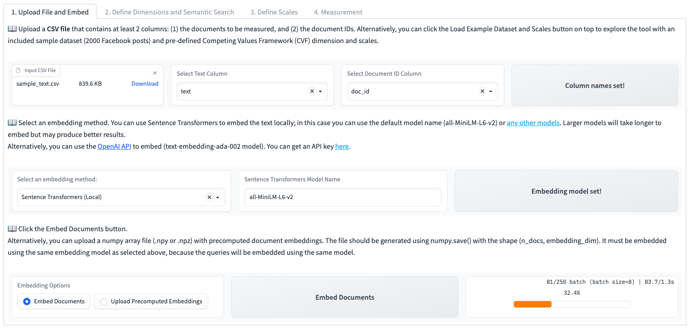
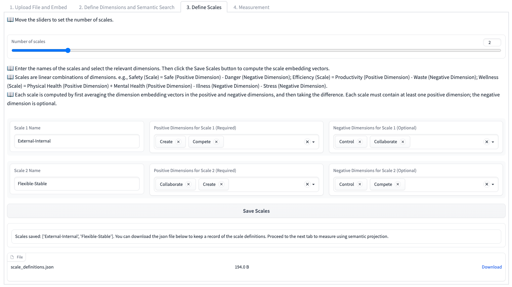
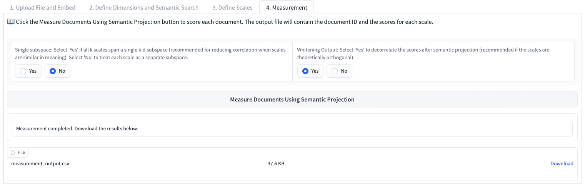

    

        
    

    

        <h1>SPAR: Semantic Projection with Active Retrieval</h1>
    

- [Overview](#overview)
- [Installation and Quick Start](#installation-and-quick-start)
- [Interface and Usage](#interface-and-usage)
- [Limitations](#limitations)
- [License](#license)

## Overview
SPAR is a Python NLP package that facilitates interactive measurement of text using LLMs. With SPAR, you can quantify short documents (e.g., social media posts) based on theoretical concepts such as *`creativity`* and *`collaboration`*, by measuring their semantic similarity with a set of example (seed) documents. 

**How it works:**
1. Start with   
   i. A corpus of documents that you want to measure;  
   ii. generic seed sentences that define theoretical concepts, e.g., `Creativity: we should innovate` and `Collaboration: we should collaborate`.   
2. Embed them into a semantic space using a pre-trained LLM.
3. Use semantic search to find domain-specific exemplary documents in the corpus that reflect the theoretical concepts in context. For example:  _`'We encourage new ways of thinking'`_, _`'We should working together to weather the storm'`_.
4. Compute the dot product between docuements and exemplary documents. 

**Main features:**

* Enables domain-adaptive and few-shot measurements of theoretical concepts without requiring model training or fine-tuning. 
* Combines the idea of semantic projection with active semantic search ([Grand et al. 2022](https://www.nature.com/articles/s41562-022-01316-8), Blinded Authors 2023), which allows users to find the most relevant, context-specific documents to define the theoretical scales. 
* Supports multiple state-of-the-arts text embedding models, such as [Sentence Transformers](https://www.sbert.net/docs/pretrained_models.html) and [OpenAI Text Embeddings API](https://platform.openai.com/docs/guides/embeddings). 
* Comes with a user-friendly web interface that makes defining theoretical scales and conducting measurements intuitive and accessible. 

If you find SPAR useful in your work, please cite the following paper:

* Blinded Authors (2023), A Computational Framework for Understanding Firm Communication During Disasters, Under Review at *Information Systems Research*.

SPAR is built on open source packages such as [HuggingFace Transformers](https://huggingface.co/transformers/), [SentenceTransformers](https://github.com/UKPLab/sentence-transformers/), and [Gradio](https://gradio.app/). 

**Please note that the project is currently in a research preview (pre-alpha) stage**. To view the planned features for the project, please see the [Road Map](ROADMAP.MD).

## Installation and Quick Start
To quickly launch SPAR in Google Colab, click the following button and run the notebook code:

You can also install SPAR on your own machine. It is recommended to use a virtual environment and upgrade pip first with `pip install -U pip`. SPAR can be installed via pip: 

    pip install -U spar-measure

To launch SPAR on your own machine, use the following command in the terminal:

    python -m spar_measure.gui

And open the interactive app in your browser at `http://localhost:7860/`.

If a CUDA GPU is available, SPAR will use it to speed up embedding. If you choose not to use a GPU, you can set the CUDA_VISIBLE_DEVICES environment variable to an empty string:

    CUDA_VISIBLE_DEVICES="" python -m spar_measure.gui

See full documentation for other usage options [here](resources/Manual.MD). 

## Interface and Usage

1. Upload a CSV file with the text content to be measured and a document ID column. Select embedding method and embed the documents.

1. Define a set of dimensions and generic seeds. For example:
   * `Creative`: *"We should adapt and innovate."*
   * `Positive emotion`: *"We are happy."*
   * `Danger`: *"It is dangerous."*
  
2. Using the generic seeds as query, search for sentences in the corpus that are similar to the generic seeds. 
    For example:

   * `Creative`: 
     * *"Digital technology will play a huge role going forward."*
     * *"How do you adapt to these uncharted waters? "*
   * `Positive emotion`: 
     * *"The smiling faces say it all."*
     * *"A round of applause to all of our recent WaFd Foundation grant recipients!"*
   * `Danger`: *"How do you prevent the spread of a deadly virus?"*
    
    Repeat this step and use the relevant outputs as new queries to search for more sentences that exemplify the dimensions.

    Enter the final context-specific exemplary sentences to the query box and click the "Embed Queries and Save Dimensions" button. The average embedding vectors of the exemplary sentences will be used to define the scale for measuring the documents.

3. Define scales, which consists of one or more demensions. For example:  
     * `Sentiment = Positive emotion - Negative emotion`
     * `Creativity = Creative` 

1. Project the document embeddings onto the scale. A CSV file with the results can be downloaded.

## Limitations
* SPAR may not be suitable for longer or more complex documents since it represents a document using a single vector.
* Sentence embeddings may not be suitable for theoretical constructs that rely primarily on syntactic features.
* Pretrained LLMs may not have up-to-date world knowledge or new vocabularies.
* Semantic projection is a linear operation, so it may not capture non-linear patterns in the data as well as fine-tuning approaches.

## License
GPL-3.0